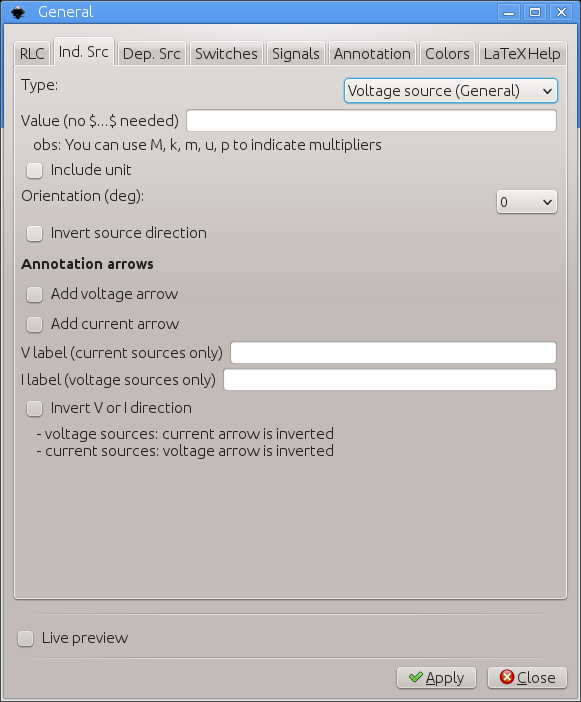
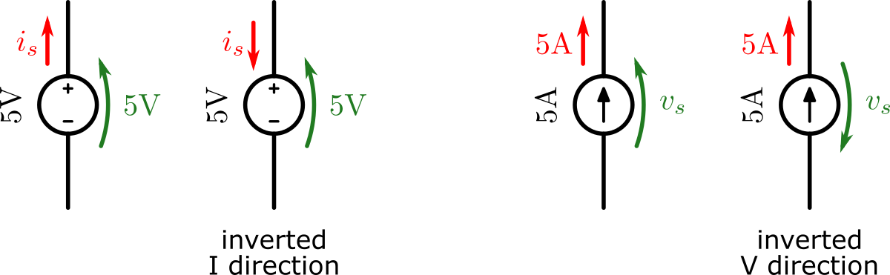
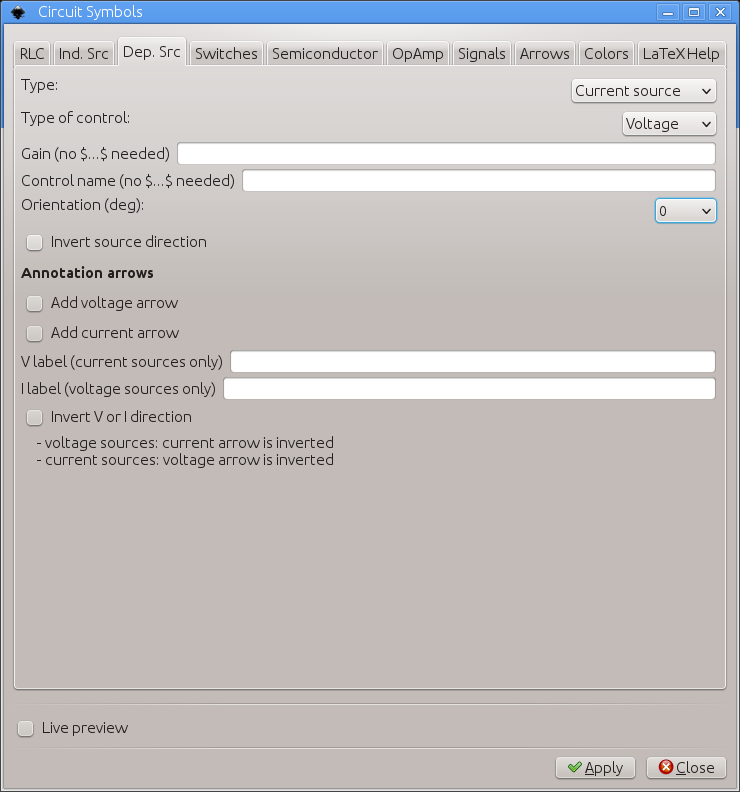
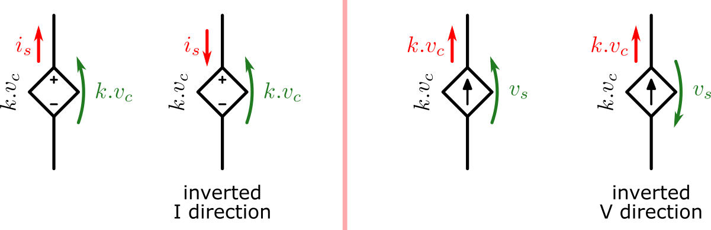
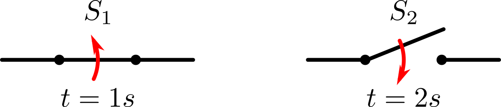
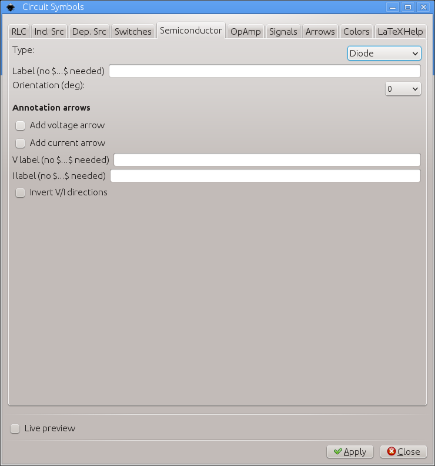
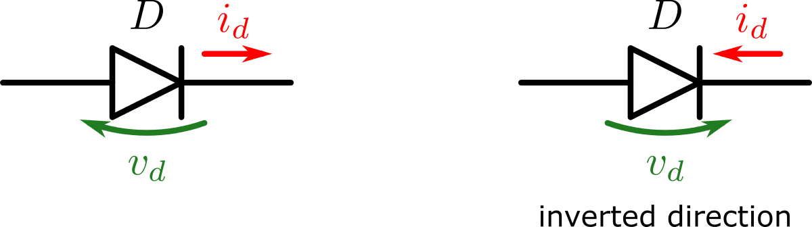
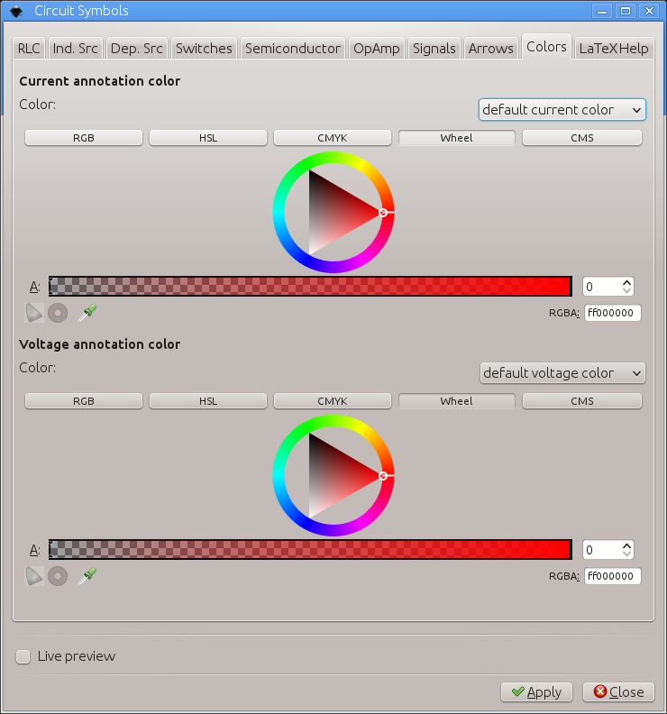

# circuitSymbols
Inkscape extension to assist creating circuit symbols.


### main features

The main features are

 - Passive bipoles: resistors, capacitors, inductors, diodes, LEDs, photo diodes, 2 way switch
 - Active bipoles: various independent and dependent voltage/current sources
 - Operational amplifiers
 - Signal labeling generator with a few commonly used signals predefined
 - Each element can be labeled individually. Numeric nominal values are supported with optional unit inclusion
 - current and/or voltage arrows can be added to all elements, with custom labels. Their directions are adjustable.
 - adjustable orientation is available
 - optional LaTeX support

# Installation and requirements

This extension was partially developed in Inkscape 0.48 and partially in 0.91 in Linux (Kubuntu 12.04 and 14.04). It should work on both versions of Inkscape. Also, they should work in different OSs too as long as all requirements are installed.

This extension requires another extension to run, inkscapeMadeEasy <https://github.com/fsmMLK/inkscapeMadeEasy>, which contains several backstage methods and classes.

In order to use circuitSymbols extension, you must also download inkscapeMadeEasy files and put them inside Inkscape's extension directory. Please refer to inkscapeMadeEasy installation instructions. In the end you must have the following files and directories in your Inkscape extension directory.

```
inkscape/extensions/
            |-- inkscapeMadeEasy_Base.py
            |-- inkscapeMadeEasy_Draw.py
            |-- inkscapeMadeEasy_Plot.py
            |-- textextLib
            |   |-- __init__.py
            |   |-- basicLatexPackages.tex
            |   |-- CircuitSymbolsLatexPreamble.tex      <-- add this file to  textextLib  subdirectoy
            |   |-- textext.inx
            |   |-- textext.py
            |
            |-- circuitSymbols.py
            `-- circuitSymbols.inx
```

**LaTeX package requirement**

If LaTeX support is enables (see below), you will need in your system the following packages: amsmath, amsthm, amsbsy, amsfonts, amssymb, siunitx, steinmetz


**Disabling LaTeX support of inkscapeMadeEasy**

Many of the methods implemented in inkscapeMadeEasy project use LaTeX to generate text. To this end I decided to employ the excellent extension **textext** from Pauli Virtanen  <https://pav.iki.fi/software/textext/>. 

LaTeX support via textext extension requires LaTeX typesetting system in your computer (it's free and awesome! =] ), together with a few python modules (pygtk and Tkinter among others). The later might be a problem for non-Linux systems (precompiled inkscape for Windows as OS X don't come with them).

Since many people don't use LaTeX and/or don't have it installed, inkscapeMadeEasy's LaTeX support is now optional. **By default, LaTeX support is ENABLED.**

Please refer to <https://fsmmlk.github.io/inkscapeMadeEasy/#installation-and-requirements> on how to easily disable LaTeX support.

.. warning:: Since disabling LaTeX support is a new feature, this project was not yet extensively checked for misplacements/errors when this support is disabled. Please report any issues you find.

# Usage

This extension is presented in several tabs. Depending on which tab is on top, the extension will create different elements in your document as soon as you click on `Apply` button (or check `live preview`). The modes are RLC elements, independent sources, dependent sources, switches, semiconductors, operational amplifiers, signals and annotation.

### RLC tab


**Type:** You can select the type of bipole. The available types are:


**Value:** Value of the bipole. If LaTeX support is enabled, this text will be included in a math environment $...$. You don't have to enclose your text between $...$. If you type numeric values, you can use ``M,k,m,u,p`` to indicate multiplier unit.

**Include unit:** If selected, unit will be automatically added to the value. The unit will be selected accordingly with the type (ohm for resistors and generic bipole, farad for capacitors, henry for inductors).

> Note: If LaTeX support is enabled, the unit will be inserted using ``siunitx`` package.


**Orientation:** Rotation angle in degrees.


**Add voltage/current arrow:** add voltage drop and current arrow indications.

**V/I labels:** Label of the voltage drop and current arrows. If LaTeX support is enabled, this text will be included in a math environment $...$. You don't have to enclose your text between $...$.

**Invert V/I directions:** invert the directions of the arrows. Keep in mind that they will ALWAYS follow the **receiver convention** (current flows in the direction of the voltage drop).


### Independent source tab



**Type:** You can select the type of source. The available types are:


**Value:** Value of the bipole. If LaTeX support is enabled, this text will be included in a math environment $...$. You don't have to enclose your text between $...$. If you type numeric values, you can use ``M,k,m,u,p`` to indicate multiplier unit.

**Include unit:** If selected, unit will be automatically added to the value. The unit will be selected accordingly with the type (volt for voltage source and ampere for current source).

> Note: If LaTeX support is enabled, the unit will be inserted using ``siunitx`` package.


**Orientation:** Rotation angle in degrees. See *RLC tab* section for examples.

**Invert source direction:** invert the direction of the source.

**Add voltage/current arrow:** add voltage drop and current arrow indications.

**V label:** (current sources only) Label of the voltage drop arrow in current sources. This parameter does not change the label of the  voltage drop across voltage sources (the label matches its Value). If LaTeX support is enabled, this text will be included in a math environment $...$. You don't have to enclose your text between $...$.

**I label:** (voltage sources only)  Label of the current in voltage sources. This parameter does not change the label of the current passing in current sources (the label matches its Value). If LaTeX support is enabled, this text will be included in a math environment $...$. You don't have to enclose your text between $...$.

**Invert V or directions:** invert the directions of one of the arrows as following:
  - current sources: invert voltage drop direction
  - voltage sources: invert current direction




### Dependent source tab



**Type:** You can select the type of source.


**Type of control:** You can select the type of control.

> Note: Together with the source, the extension will create control arrows in all possible directions. This allow you to choose from them the arrow that fits to your situation.

> 

**Gain:** control gain of the source. If LaTeX support is enabled, this text will be included in a math environment $...$. You don't have to enclose your text between $...$. If you type numeric values, you can use ``M,k,m,u,p`` to indicate multiplier unit.

**Control name:** Label of the control signal (voltage or current, depending on the type of control. If LaTeX support is enabled, this text will be included in a math environment $...$. You don't have to enclose your text between $...$. If you type numeric values, you can use ``M,k,m,u,p`` to indicate multiplier unit.


**Orientation:** Rotation angle in degrees. See *RLC tab* section for examples.

**Invert source direction:** invert the direction of the source.


**Add voltage/current arrow:** add voltage drop and current arrow indications.

**V label:** (current sources only) Label of the voltage drop arrow in current sources. This parameter does not change the label of the  voltage drop across voltage sources (the label matches its Value). If LaTeX support is enabled, this text will be included in a math environment $...$. You don't have to enclose your text between $...$.

**I label:** (voltage sources only)  Label of the current in voltage sources. This parameter does not change the label of the current passing in current sources (the label matches its Value). If LaTeX support is enabled, this text will be included in a math environment $...$. You don't have to enclose your text between $...$.

**Invert V or directions:** invert the directions of one of the arrows as following:
  - current sources: invert voltage drop direction
  - voltage sources: invert current direction




### Switches tab


**Type:** You can select the type of switch. At the moment there is only one type of switch.


**Label:** Label of the switch. If LaTeX support is enabled, this text will be included in a math environment $...$. You don't have to enclose your text between $...$.

**Orientation:** Rotation angle in degrees. See *RLC tab* section for examples.

**Open switch:** toggles the state of the switch

**Draw open/close arrow:** Adds annotation arrow indicating change of state.

**Open/close text:** Adds text near the annotation arrow. Useful to express the time when the switch changes state.




### Semiconductor tab



**Type:** You can select the type of semiconductor. The available types are:


**Label:** Label of the switch. If LaTeX support is enabled, this text will be included in a math environment $...$. You don't have to enclose your text between $...$.

**Orientation:** Rotation angle in degrees. See *RLC tab* section for examples.

**Add voltage/current arrow:** add voltage drop and current arrow indications.

**V/I labels:** Label of the voltage drop and current arrows. If LaTeX support is enabled, this text will be included in a math environment $...$. You don't have to enclose your text between $...$.

**Invert V/I directions:** invert the directions of the arrows. Keep in mind that they will ALWAYS follow the **receiver convention** (current flows in the direction of the voltage drop).



### Operational amplifier tab


**Type:** You can select the type of operational amplifier. At the moment there is only one type of OpAmp.


**Invert inputs:** invert the position between inverting and non inverting inputs

**Add supply terminals:** draw supply terminals.

**Add supply values:** add values to supply terminals. This parameter has effect only if `Add supply terminals` is checked.

**Symmetric supply:** force symmetric supply. This parameter has effect only if `Add supply values` is checked.

**+V/-V supply label:** positive/negative supply values. -V is used only if `Symmetric supply` is unchecked. 


**Add input voltage labels (v+) (v-):** add input nodal voltage annotation.

**Add input voltage labels (i+) (i-):** add input current annotation.

**Add output voltage label (Vout):** add output nodal voltage annotation.

**Add output current label (Vout):** add output current annotation.

**Add input differential voltage arrow (Vd):** add input differential voltage annotation.

**v+/v- label:** labels of input nodal voltages

**i+/i- label:** labels of input currents

**Vout/Iout label:** labels of the output voltage and current

**Vd label:** label of the input differential voltage


### Signals tab


**Type:** Allows the selection of one type of signal. You can select a few commonly used signal or select ``Custom`` to customize its label. (see below)


**Custom label:** Label of the signal. Used only if ``Custom`` is selected in `Type`. If LaTeX support is enabled (see `Installation and requirements` section) the text will be inserted in a mathematical environment $...$

**Direction:** Direction of the line segment.


**Draw line:** signal line toggle.


### Annotation tab

This tab allows you to create custom voltage or current annotation to add to your circuits.


**Type:** You can select voltage or current annotation


**Label:** Label of the annotation. If LaTeX support is enabled, this text will be included in a math environment $...$. You don't have to enclose your text between $...$.

**Orientation:** Rotation angle in degrees. See *RLC tab* section for examples.

**Arrow size:** size of the arrow. There is one field for voltage annotation and another for current.

**Invert arrow direction:** invert the directions of the arrows.

**Invert disposition:** invert disposition of the annotation.

  -  voltage annotation: inverts the curvature of the arrow
  -  current annotation: inverts the side of the text


### Color tab



This tab is divided in two sections. The first control the color of current annotation, the second controls the color of voltage annotation.

In both cases, you have two options in the `Color` drop down menu:

  - You can select the predefined colors as presented below


  - You can select **use color picker** to choose the color from the color picker widget just below the `Color` drop down menu. **Attention:** the color selected in the color picker widget will be considered **ONLY** if you select **use color picker** in the drop down menu. 

# Observations

 - The objects will be created at the center of your screen.


