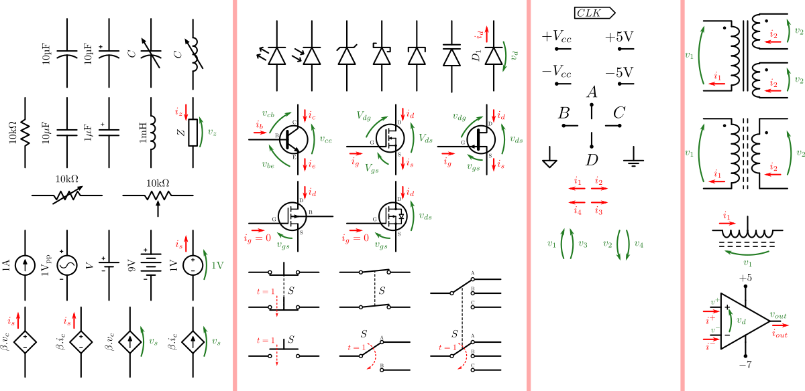

# circuitSymbols

This extension will assist you creating electric symbols in [Inkscape](https://inkscape.org/).



## main features

The main features of this extension are

 - Passive bipoles: resistors, capacitors, inductors, diodes, LEDs, photo diodes, nPnT switches
 - Active bipoles: various independent and dependent voltage/current sources
 - Operational amplifiers
 - Bipolar and FET transistors
 - Signal labeling generator and predefined common signals.
 - Each element can be labeled individually. Numeric nominal values are supported with optional unit inclusion.
 - Current and/or voltage indication arrows can be added to all elements, with custom labels. Their directions are adjustable.
 - You can choose between active and passive sign convention for all elements
 - adjustable orientation is available
 - optional LaTeX support

This is a work-in-progress project. New components will be added in the future.

## Current and older versions

Compatibility table

|  Inkscape        |  circuitSymbols | inkscapeMadeEasy | Receive updates?|
|------------------|-----------------|------------------|-----------------|
|       1.0        | 1.0 (latest)    |   1.0 (latest)   | YES             |
| 0.48, 0.91, 0.92 | 0.9x (obsolete) |  0.9x (obsolete) | NO              |


**Latest version:** The latest version of **circuitSymbols** is **1.0**. This version is compatible with Inkscape 1.0 and up only. It is **incompatible** with older Inkscape versions!

**Older versions:** If you have an older version of Inkscape, please use the files under the folder **0.9x** on Github.

**Important: Only the latest version will receive updates, new features, and bug fixes! The usage section in this documentation describes the latest version. In older versions, the disposition of the elements in the plugin's screen might be different. Some features might not be present or have different behavior.**

# Installation and requirements

Installation procedures for latest and older versions are described below.

## Requirements (all versions)

- You will need [inkscapeMadeEasy](https://github.com/fsmMLK/inkscapeMadeEasy) plugin installed. Check the compatibility table above to know the version you need.

## Installation procedure (v1.0 only)

**circuitSymbols** was developed using Inkscape 1.0 in Linux (Kubuntu 18.04). It should work in different OSs too as long as all requirements are met.

1. Install [inkscapeMadeEasy](https://github.com/fsmMLK/inkscapeMadeEasy), **version 1.0** (latest). Follow the instructions in the manual page. **Note:** LaTeX text is used in **circuitSymbols** if the support is activated (nicer results), otherwise regular text elements will be used.

2. **circuitSymbols** installation

    1. Go to Inkscape's extension directory with a file browser. Your inkscape extension directory can be accessed by opening Inkscape and selecting ``Edit > Preferences > System``. Look for the item **User Extensions**  field. There is a button on the right of the field  that will open a file explorer window in that specific folder.

    2. Create a subfolder in the extension directory with the name ``circuitSymbols``. **Important:**  Be careful with upper and lower case letters. You must write as presented above.

    3. Download **circuitSymbols** files and place them inside the directory you just created.

       You don't have to copy all files from Github. The files you will need are inside the ``latest`` folder. In the end you must have the following files and directories in your Inkscape extension directory.

       **LaTeX users:** the file `circuitSymbolsPreamble.tex` contains the macros defined in this plugin. You can add your own macros to this file. You can also add macros to ``inkscapeMadeEasy/basicLatexPackages.tex``. In this case the same macros will be accessible by all plugins that employ inkscapeMadeEasy.

        ```
        inkscape
         ┣━━extensions
         ┋   ┣━━ inkscapeMadeEasy      <-- inkscapeMadeEasy folder
             ┃    ┣━━ inkscapeMadeEasy_Base.py
             ┃    ┣━━ inkscapeMadeEasy_Draw.py
             ┃    ┣━━ inkscapeMadeEasy_Plot.py
             ┃    ┗━━ basicLatexPackages.tex
             ┃
             ┣━━ textext               <-- texText folder (if you installed textText)
             ┃    ┋
             ┃
             ┣━━ circuitSymbols        <-- circuitSymbols folder
             ┋    ┣━━ circuitSymbolsPreamble.tex
                  ┣━━ circuitSymbols_semiconductors.inx
                  ┣━━ circuitSymbols_general.inx
                  ┣━━ circuitSymbols.py
                  ┣━━ drawAmpOp.py
                  ┣━━ drawArrows.py
                  ┣━━ drawDiodes.py
                  ┣━━ drawRLC.py
                  ┣━━ drawSignals.py
                  ┣━━ drawSources.py
                  ┣━━ drawSwitches.py
                  ┗━━ drawTransistors.py
        
        NOTE: You might have other sub folders inside the extensions directory. They don't interfere with the plugin.
        ```

## Installation procedure (v0.9x only)

**circuitSymbols** was developed using Inkscape 0.48 and 0.91 in Linux (Kubuntu 18.04). It should work in different OSs too as long as all requirements are met.

1. Install [inkscapeMadeEasy](https://github.com/fsmMLK/inkscapeMadeEasy), **version 1.0** (latest). Follow the instructions in the manual page. **Note:** LaTeX text is used in **circuitSymbols** if the support is activated (nicer results), otherwise regular text elements will be used.

2. **circuitSymbols** installation

    1. Go to Inkscape's extension directory with a file browser.

    2. Download **circuitSymbols** files and place them inside the directory you just created.

       You don't have to copy all files from Github. The files you will need are inside the ``0.9x`` folder. In the end you must have the following files and directories in your Inkscape extension directory.

        ```
        inkscape
         ┣━━ extensions
         ┋    ┣━━ inkscapeMadeEasy_Base.py
              ┣━━ inkscapeMadeEasy_Draw.py
              ┣━━ inkscapeMadeEasy_Plot.py
              ┃
              ┣━━ textextLib
              ┃    ┣━━ __init__.py
              ┃    ┣━━ basicLatexPackages.tex
              ┃    ┣━━ CircuitSymbolsLatexPreamble.tex     <-- from repository folder 0.9x!
              ┃    ┣━━ textext.inx
              ┃    ┗━━ textext.py
              ┃
              ┣━━ circuitSymbols.py                  <--
              ┣━━ drawAmpOp.py                       <--
              ┣━━ drawArrows.py                      <--
              ┣━━ drawDiodes.py                      <--
              ┣━━ drawRLC.py                         <--
              ┣━━ drawSignals.py                     <--   from repository folder 0.9x!
              ┣━━ drawSources.py                     <--
              ┣━━ drawSwitches.py                    <--
              ┣━━ drawTransistors.py                 <--
              ┣━━ circuitSymbols_semiconductors.inx  <--
              ┗━━ circuitSymbols_general.inx         <--
        ```

# Usage

This extension is presented in two menu entries: **General** and **Semiconductor**. Both can be found under `extensions > fsmMLK > Circuit symbols` menu.

The first generates symbols of commonly used circuit elements like resistors, capacitors, inductors, switches and various independent and dependent voltage/current sources.

The second generates semiconductor elements like diodes, transistors and operational amplifiers.

Each entry has several tabs. Depending on which tab is on top, the extension will create different elements in your document as soon as you click on `Apply` button (or check `live preview`).

In addition to these elements, both menu entries has extra tabs to generate signal labels and annotations. They are repeated in both entries to facilitate its use.

# GENERAL menu entry


## RLC tab

In this tab you can create resistors, capacitors and inductors. The section **Voltage and current indications** serves to add voltage or current annotation arrows to the symbol and adjust their orientations.


**Type:** You can select the type of bipole. The available types are:


**Orientation:** Rotation angle in degrees.


**Value:** Literal or numeric value of the bipole. If you type numeric values, you can use ``M,k,m,u,n,p`` to indicate multiplier unit. If LaTeX support is enabled, this text will be included in a math environment $...$. Also for LaTeX, there are a couple of functions to specify values in terms of complex impedances. See image below for examples.

**Add unit:** If selected, unit will be automatically added to the value. The unit will be selected accordingly with the type (ohm for resistors and generic bipole (impedance), farad for capacitors, henry for inductors).

> Note: If LaTeX support is enabled, the unit will be inserted using ``siunitx`` package.


### **Voltage and current indications section**

**Sign convention:** Switches between passive and active sign conventions. This option affects the symbol only if you add voltage and current indications.


**Add voltage/current indications:** Add voltage drop and current arrow indications. On the side there are fields for the labels of the annotations. If LaTeX support is enabled, this text will be included in a math environment $...$.

**Invert V/I directions:** invert the directions of the annotations. Keep in mind that they will still follow the sign convention you selected.


## Sources tab

In this tab you can create voltage and current. The sources can be independent or dependent (contolled).

This tab contains two subtabs, *Independent* and *Dependent*. The 'Apply' button will execute the action associated to the subtab that is on the top.

There is also a common section called **Voltage and current indications** that will serve both types of sources to add voltage or current annotation arrows to the symbol and adjust their orientations.


### Independent source subtab


**Type:** Here you can select the type of source. The available types are presented below. 


**Orientation:** Rotation angle in degrees. See *RLC tab* section for examples.

**Invert source direction:** invert the direction of the source.

**Value:** Literal or numeric value of the bipole. If you type numeric values, you can use ``M,k,m,u,n,p`` to indicate multiplier unit. If LaTeX support is enabled, this text will be included in a math environment $...$. Also for LaTeX, there are a couple of functions to specify values in terms of phasors. See examples below.

**Add unit:** If selected, unit will be automatically added to the value. The unit will be selected accordingly with the type (V for voltages and A for current).

> Note: If LaTeX support is enabled, the unit will be inserted using ``siunitx`` package.


### Dependent source subtab


**Type:** Here you can select the type of source. The available types are presented below. 


**Orientation:** Rotation angle in degrees. See *RLC tab* section for examples.

**Invert source direction:** invert the direction of the source.

**Control:** You can select the type of control, *votage* or *current*.

**Gain:** control gain of the source. If LaTeX support is enabled, this text will be included in a math environment $...$.

**Control signal:** Label of the control signal (voltage or current, depending on the type of control). If LaTeX support is enabled, this text will be included in a math environment $...$.

**Draw congtrol indications:** If selected, the extension will create control indication arrows in all possible directions. This allow you to choose from them the arrow that fits your situation.

> 

### **Voltage and current indications section**

**Sign convention:** Switches between passive and active sign conventions. This option affects the symbol only if you add voltage and current indications. See *RLC tab* section for examples.

**Add voltage/current indications:** Add voltage drop and current arrow indications. On the side there are fields for the labels of the annotations. If LaTeX support is enabled, this text will be included in a math environment $...$.

   - *Voltage label:* The contents of the text box affects current sources only. For voltage sources, the label will be the same of the value. If LaTeX support is enabled, this text will be included in a math environment $...$.

   - *Current label:* The contents of the text box affects voltage sources only. For current sources, the label will be the same of the value. If LaTeX support is enabled, this text will be included in a math environment $...$.

**Invert V or I directions:** invert the directions of the indications. If activated, a negative sign will be automatically added to:
  - Voltage annotation in voltage sources
  - Current annotation in current sources   


## Switches tab

In this tab you can create switches. The section **Commuting information** allows you to configure commutation annotation. The section **Voltage and current indications** serves to add voltage or current annotation arrows to the symbol and adjust their orientations.


**Number of poles/throws:** Here you can select the number of poles (1 to 4) and throws (1 to 8) of the switch (nPmT). See examples below.


**Orientation:** Rotation angle in degrees. See *RLC tab* section for examples.

**Label:** Set the text of the label of the switch. If LaTeX support is enabled, this text will be included in a math environment $...$.

**Push-button:** Sets the switch to push-button. Activating this option will force number of throws to one (nT=1).


**Current state:** Here you can select which output channel is connected to the input, if any (open switch). If the number selected here is larger than the number of outputs (nT), the last output will be connected.


### Commutating information section

**Commutating arrow:** Adds annotation arrow indicating change of state. See image below

**Commuting text:** Adds text near the commuting arrow. Useful to express the time when the switch changes state. See image below

**Direction:** invert commuting arrow direction. Used only if nT > 1


### **Voltage and current indications section**

**Sign convention:** Switches between passive and active sign conventions. This option affects the symbol only if you add voltage and current indications.  See *RLC tab* section for examples.


**Add voltage/current indications:** Add voltage drop and current arrow indications. On the side there are fields for the labels of the annotations. If LaTeX support is enabled, this text will be included in a math environment $...$.

**Invert V/I directions:** invert the directions of the annotations. Keep in mind that they will still follow the sign convention you selected. See *RLC tab* section for examples.


## Sig./Ind tab

This tab is presented in two subtabs, *Signals* and *Indications*. The first create signal nodes to add to your circuit. The second creates custom voltage and current arrow indications to use in your circuit. The 'Apply' button will execute the action associated to the subtab that is on the top


### Signals subtab


**Type:** Allows the selection of the type of signal. You can select a few commonly used signal or select ``Custom`` to customize its label. (see below)

  

**Direction:** Direction of the signal line. This option is used only if ``Draw signal line`` option is enabled.

**Label:** Label of the signal. This option is used only if ``Custom`` or ``Digital`` is selected in `Signal type`. If LaTeX support is enabled the text will be inserted in a mathematical environment $...$


**Draw signal line:** signal line toggle. 


### Indication subtab

This tab allows you to create custom voltage or current indications to add to your circuits.


**Type:** You can select voltage or current indication arrows.


**Orientation:** Rotation angle in degrees. See *RLC tab* section for examples.

**Invert direction:** invert the directions of the arrows.

**Invert disposition:** invert disposition of the indications. See image below.

  -  voltage arrow: inverts the curvature of the arrow
  -  current arrow: inverts the side of the text


**Label:** Label of the indication. If LaTeX support is enabled the text will be inserted in a mathematical environment $...$

**Add unit:** If selected, unit will be automatically added to the value. The unit will be selected accordingly with the type (V for voltage and A for current).

**Indication size:** Sizes of the arrows. There is one field for voltage and another for current arrows.

### Color Setup section

This section controls the color of current and voltage indications.

In both cases, you have two options in the `Color` drop down menu:

  - You can select the predefined colors. They are presented below


  - You can select **use color picker** to choose the color from the color picker widget just to the right of the drop down menu. **Attention:** the color selected in the color picker widget will be considered **ONLY** if you select **use color picker** in the drop down menu. 


# SEMICONDUCTOR menu entry

## Diodes tab

In this tab you can create diodes and LEDs.


**Type:** You can select the type of semiconductor. The available types are:


**Orientation:** Rotation angle in degrees. See *RLC tab* section for examples.

**Invert diode direction:** invert the direction of the diode.

**Label:** Label of the indication. If LaTeX support is enabled the text will be inserted in a mathematical environment $...$


### **Voltage and current indications section**

**Sign convention:** Switches between passive and active sign conventions. This option affects the symbol only if you add voltage and current indications.  See *RLC tab* section for examples.


**Add voltage/current indications:** Add voltage drop and current arrow indications. On the side there are fields for the labels of the annotations. If LaTeX support is enabled, this text will be included in a math environment $...$.

**Invert V/I directions:** invert the directions of the annotations. Keep in mind that they will still follow the sign convention you selected. See *RLC tab* section for examples.


## BJT tab

In this tab you can create BJT (photo)transistors.


**Type/Phototransistor:** You can select the type of transistor.


**Orientation:** Rotation angle in degrees. See *RLC tab* section for examples.

**Phototransistor:** Turns the BJT into a phototransistor. See image above.


**Draw Envelope:** Draws an envelope circle around the transistor


**Switch Emitter/Collector terminals:** Switch terminals. **Attention:** This will not switch between NPN and PNP transistors.


**Add E/B/C tags:**  Add emitter, base and collector labels to the symbols. See image below.


### **Voltage and current indications section**

**Add v_CE/v_CB/v_BE indications:**  Add voltage drop indications across the transistor. On the side there are fields for the labels of the annotations. If LaTeX support is enabled, this text will be included in a math environment $...$. See image below.

**Add i_C/i_B/i_E indications:** Add collector, base and emitter current indications. On the side there are fields for the labels of the annotations. If LaTeX support is enabled, this text will be included in a math environment $...$. See image below.


## FET tab

In this tab you can create MOSFET and JFET transistors.


**FET Type / Channel type:** Specifies  the type of FET.


**4-terminal MOSFET (MOSFET only):** Switch between 3 and 4-terminal MOSFETs.


**Orientation:** Rotation angle in degrees. See *RLC tab* section for examples.

**Add body diode (3-terminal MOSFET-E only):** Draws the body diode of power MOSFETs.


**Move gate towards the source (JFET only):** Moves gate terminal.


**Draw Envelope:** Draws an envelope circle around the transistor


**Switch Source/Drain terminals:** Switch terminals. **Attention:** This will not switch between different channel types.


**Add S/G/D tags:**  Add source, gate and drain labels. See image below.

### **Voltage and current indications section**

**Add v_GS/v_DS/v_DG indications:**  Add voltage drop indications across the transistor. On the side there are fields for the labels of the indication. If LaTeX support is enabled, this text will be included in a math environment $...$. See image below.

**Add i_D/i_S/i_G indications:** Add drain, source and gate current indications. On the side there are fields for the labels of the indication. If LaTeX support is enabled, this text will be included in a math environment $...$. See image below.


## Operational amplifier tab

In this tab you can create operational amplifiers.


**Type:** You can select the type of operational amplifier. At the moment there is only one type of OpAmp.


**Invert inputs:** invert the position between inverting and non inverting inputs


### **Supply section**

**Add supply terminals:** draw power supply terminals. See image below

**Add supply values:** Add signal nodes to supply terminals. This parameter has effect only if `Add supply terminals` is checked. See image below

**Symmetric supply:** Force symmetric supply. This parameter has effect only if `Add supply values` is checked. See image below

**+V/-V supply label:** positive/negative supply values. -V is used only if `Symmetric supply` is unchecked.  See image below


### **Voltage and current indications section**

**Add (v+) (v-) indications:** add input nodal voltage indications.  On the side there are fields for the labels of the indications. If LaTeX support is enabled, this text will be included in a math environment $...$. See image below.

**Add (i+) (i-) indications:** add input current indications. On the side there are fields for the labels of the indications. If LaTeX support is enabled, this text will be included in a math environment $...$. See image below.

**Add V_out indication:** add output nodal voltage indication. On the side there is a text field for the label of the indication. If LaTeX support is enabled, this text will be included in a math environment $...$. See image below.

**Add I_out indication:** add output current indication. On the side there is a text field for the label of the indication. If LaTeX support is enabled, this text will be included in a math environment $...$. See image below

**Add V_d indication:** add input differential voltage indication. On the side there is a text field for the label of the indication. If LaTeX support is enabled, this text will be included in a math environment $...$. See image below


## Sig./Ind tab

This tab is identical to the tab with the same name on GENERAL menu entry. Check the documentation there.


# Observations

 - The objects will be created in the center of your screen.

 - In the file `circuitSymbolsPreamble.tex` you can add LaTeX macros and extra packages. A few functions were define there:
  

    
# Examples


